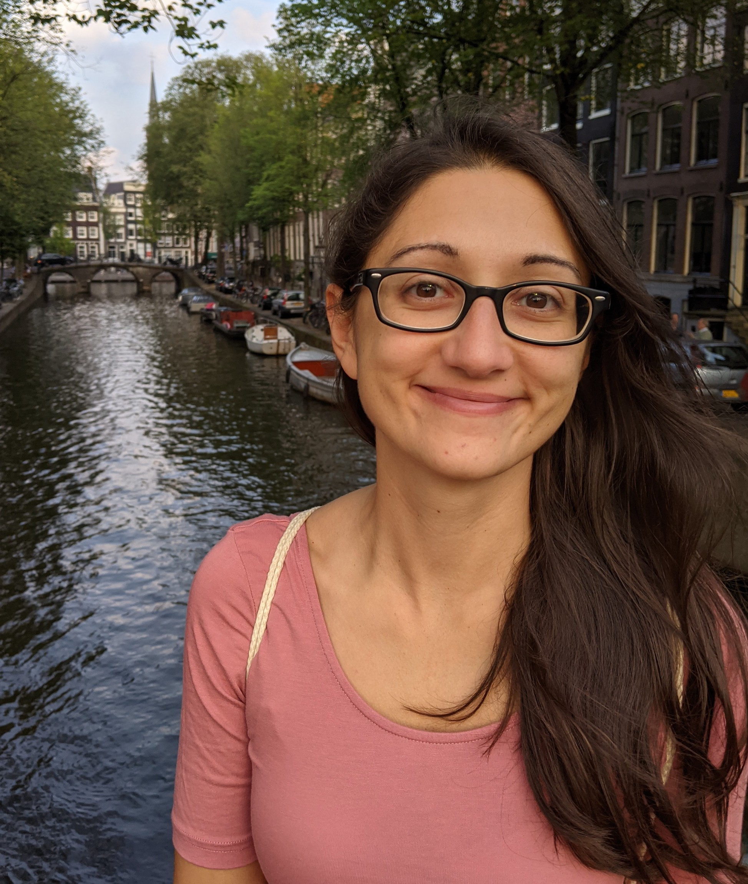

I am an Assistant Professor (tenured) in the [Department of Mathematics and Computer Science](https://www.tue.nl/en/our-university/departments/mathematics-and-computer-science) at the Eindhoven University of Technology ([TU Eindhoven](https://www.tue.nl)).
 

My research lies at the interface between theoretical and applied statistics. I am mainly interested in multivariate statistics and dependence modeling, with particular emphasis on copulas and their mathematical properties. 
My work includes the development of novel methodology for environmental sciences and weather forecasting.
 

Before joining TU Eindhoven, I was a postdoctoral fellow at the [Institute for Data, Systems and Society](https://idss.mit.edu/) of [MIT](https://www.mit.edu) (Cambridge, MA), and an Assistant Professor at the  [University of Massachusetts Lowell](https://www.uml.edu/sciences/mathematics/) (USA). I have also held research positions at [IST Austria](https://ist.ac.at/en/home/) and the [Austrian center for weather forecasting](https://www.zamg.ac.at/cms/en/news). I hold a MSc in Mathematics from the [University of Salento](https://international.unisalento.it/departments/mathematics-and-physics) (Italy) and a PhD in Mathematics from [JKU Linz](https://www.jku.at/en/institute-of-applied-statistics/) (Austria). 
 
 
